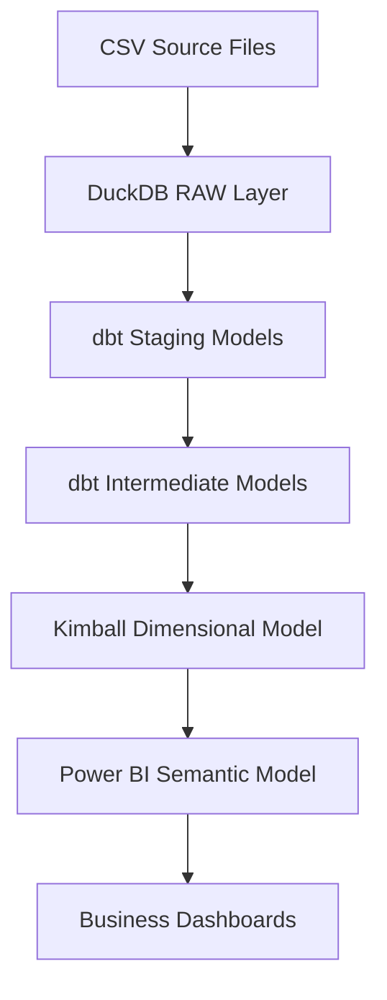
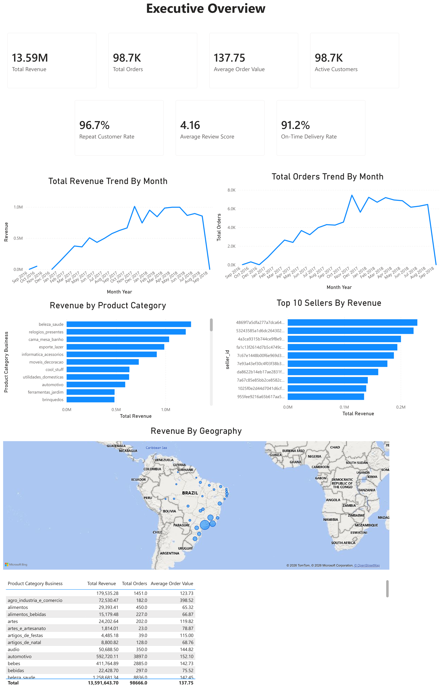
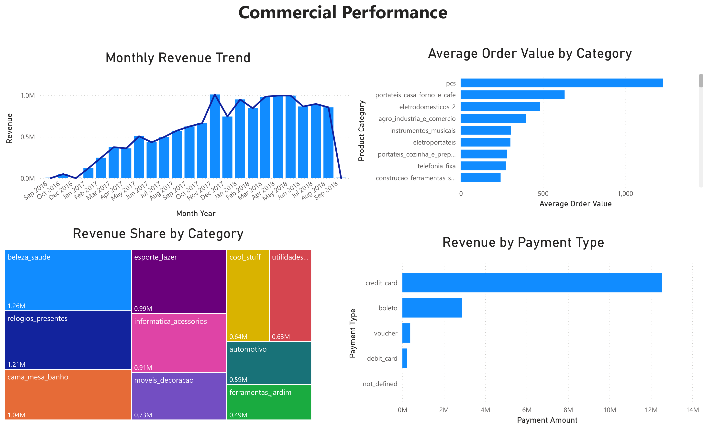
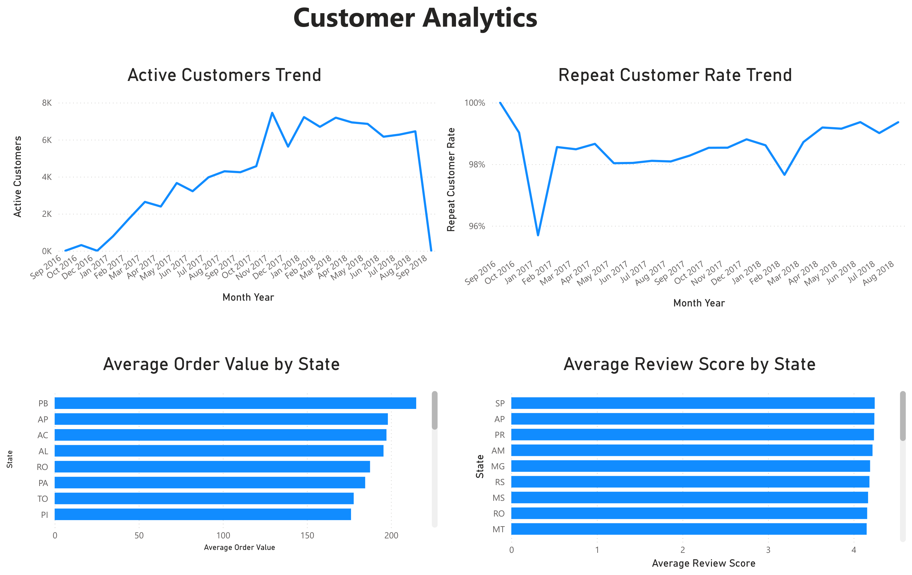
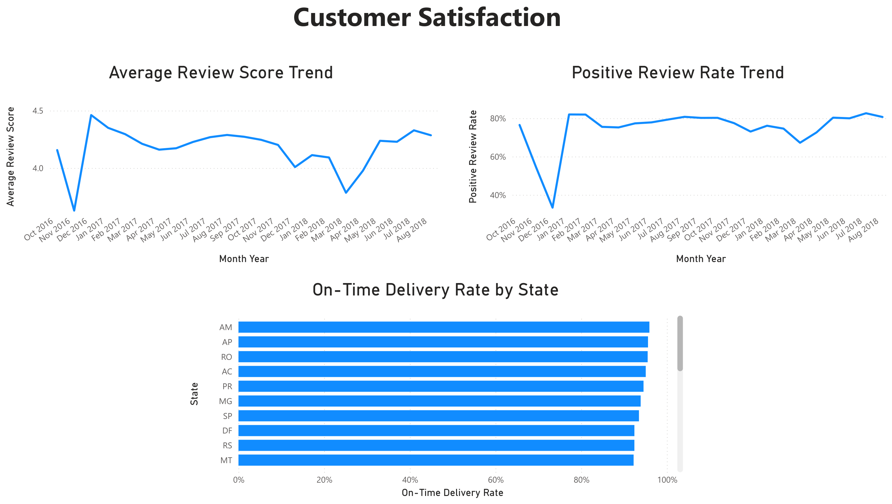

# E-commerce Analytics Engineering Case Study

> **Project Summary**
>
> This project demonstrates how an Analytics Engineer transforms raw transactional data into a trusted business reporting platform using DuckDB, dbt, Kimball dimensional modeling, automated data quality testing, Power BI semantic modeling, and interactive dashboards.

An end-to-end Analytics Engineering case study built using the Brazilian Olist E-commerce dataset.

The project demonstrates how raw transactional data can be transformed into a trusted analytical platform through dimensional modeling, dbt transformations, automated data quality testing, semantic modeling, and interactive Power BI dashboards.

Rather than demonstrating isolated technical skills, this project showcases how Analytics Engineering connects business requirements, data modeling, transformation pipelines, semantic modeling, and reporting into a complete analytical solution.

---

# Project Objectives

Design and implement a production-inspired Analytics Engineering solution that demonstrates:

- Business-driven dimensional modeling
- Modern layered dbt architecture
- Automated data quality testing
- Semantic modeling in Power BI
- Interactive business dashboards
- Comprehensive engineering documentation
- Git-based development workflow

---

# Solution Architecture



---

# Technology Stack

| Category | Technology |
| ---------|----------- |
| Data Warehouse | DuckDB |
| Transformation Framework | dbt Core |
| Programming Language | SQL |
| Reporting | Power BI |
| Version Control | Git & GitHub |
| Development Environment | Visual Studio Code |
| Query Tool | DBeaver |

---

# Engineering Highlights

Some of the key engineering decisions implemented throughout the project include:

- Business-first dimensional modeling based on documented business requirements.
- Layered dbt architecture separating source standardization, business transformations, and dimensional models.
- Kimball star schema supporting reusable business analytics.
- Custom dbt macros for reusable business transformations.
- Automated data quality validation using generic dbt tests and custom business rule tests.
- Architecture Decision Records (ADRs) documenting major design decisions.
- Warehouse improvements driven by reporting requirements rather than reporting workarounds.
- Comprehensive documentation maintained throughout the project lifecycle.

---

# Completed Solution

## Business Requirements

- Commercial Performance
- Customer Analytics
- Logistics & Fulfillment
- Customer Satisfaction

---

## Data Warehouse

### Dimensions

- dim_customer
- dim_date
- dim_geography
- dim_product
- dim_seller

### Facts

- fct_order_line
- fct_payment
- fct_review
- fct_delivery_performance

---

## Analytics Engineering

### Staging Layer

- Source standardization
- Naming conventions
- Metadata cleanup

### Intermediate Layer

- Reusable business models
- Geography standardization
- Shared enrichment logic
- Custom dbt macro

### Mart Layer

- Kimball dimensional model
- Star schema
- Surrogate key implementation
- Business-ready analytical models

---

## Data Quality

Implemented automated validation using dbt:

- Generic Tests
  - Unique
  - Not Null
  - Relationships

- Custom Business Rule Tests

Overall project status:

**97 automated dbt tests passing**

---

# Power BI Reporting

The reporting layer is built on a reusable semantic model and consists of four interactive dashboards:

- Executive Overview
- Commercial Performance
- Customer Analytics
- Customer Satisfaction

The semantic model exposes reusable business measures while hiding technical implementation details, allowing reports to focus on business analysis rather than warehouse complexity.

---

# Dashboard Preview

> *(Insert dashboard screenshots here)*

## Executive Overview



---

## Commercial Performance



---

## Customer Analytics



---

## Customer Satisfaction



---

# Repository Structure

```text
dbt/
│
├── staging/
├── intermediate/
├── marts/
│   ├── dimensions/
│   └── facts/
│
├── macros/
├── tests/
├── snapshots/
└── seeds/

docs/
duckdb/
powerbi/
scripts/
```

---

# Documentation

The repository contains comprehensive engineering documentation covering:

- Business Requirements
- Metric Definitions
- Data Model Design
- Project Scope
- Architecture
- Implementation Plan
- Deployment Strategy
- Data Quality Strategy
- Architecture Decision Records (ADRs)
- Developer Guide
- Engineering Decisions
- Source Validation
- dbt Macros
- Lessons Learned

---

# Key Lessons

Some of the most valuable lessons from the project included:

- Analytics Engineering begins with understanding business requirements rather than writing SQL.
- Data models should evolve based on observed data behavior rather than initial assumptions.
- Generic and business-specific testing are equally important for building trusted analytical data.
- Building reports can reveal opportunities to improve the warehouse itself.
- Business metrics and semantic model measures represent different concepts.
- AI is most valuable as an engineering reviewer and design partner rather than simply a code generator.

A complete retrospective is available in **Lessons Learned**.

---

# Future Enhancements

Potential future improvements include:

- CI/CD pipeline for automated dbt builds
- Containerized development environment
- Cloud data warehouse deployment
- Additional business domains
- dbt Semantic Layer
- Incremental models
- Performance benchmarking

---

# Author

**Petya Dimitrova**

Senior Analytics Engineer

Built to demonstrate modern Analytics Engineering practices, dimensional modeling, semantic modeling, and business - focused analytics.