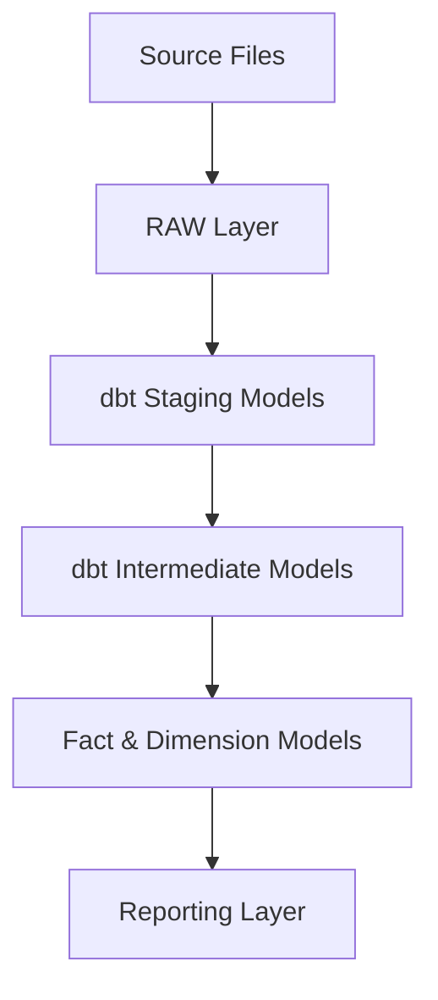

## Question Answered:
How does data flow through the solution?

## Purpose:
Describe the end-to-end architecture and transformation flow.

## Planned Architecture

Architecture Version 2 Notes

Implementation discoveries:

- dbt Sources became an explicit architectural layer.
- Staging responsibilities were formally defined.
- Timestamp naming standards (_ts / _dt) introduced.
- Source metadata standardization centralized in staging.
- Business logic intentionally deferred to intermediate models.

## Architecture Decisions

### ADR-001 Geography Standardization

The Geography domain is standardized in the Intermediate Layer.

Design principles:

- one row per unique combination of State, City and ZIP prefix
- city names are stored in lowercase
- Portuguese accented characters are removed using a reusable dbt macro
- representative coordinates are calculated using AVG(latitude) and AVG(longitude)
- no coordinates are inferred for missing ZIP prefixes
- business rules for geography standardization are implemented in reusable dbt macros

The standardized Geography model provides a consistent geographic reference for downstream dimensions and fact tables.

Implementation Note

The standardized Geography model is reused by other Intermediate models to provide geographic enrichment while preserving ownership of business attributes within each domain model.