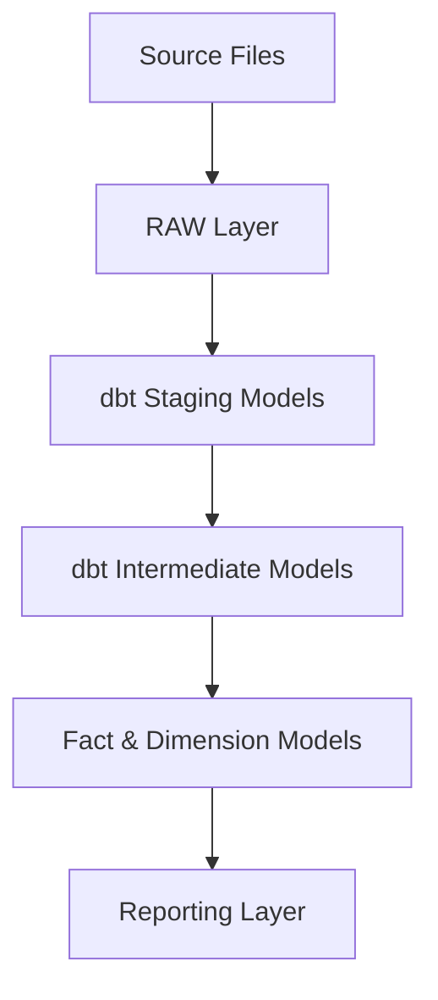

## Question Answered:
How does data flow through the solution?

## Purpose:
Describe the end-to-end architecture and transformation flow.

## Planned Architecture

```mermaid
flowchart TD
    A[Source Files]
    B[RAW Layer]
    C[dbt Staging Models]
    D[dbt Intermediate Models]
    E[Fact & Dimension Models]
    F[Reporting Layer]

    A --> B
    B --> C
    C --> D
    D --> E
    E --> F
```